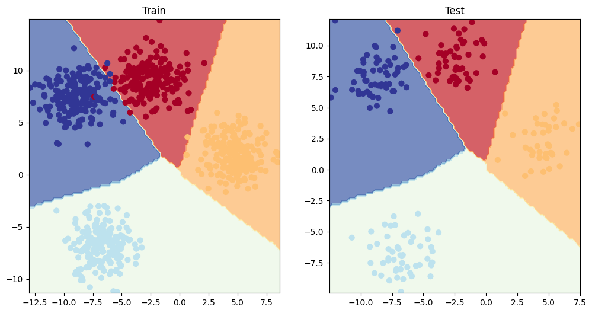
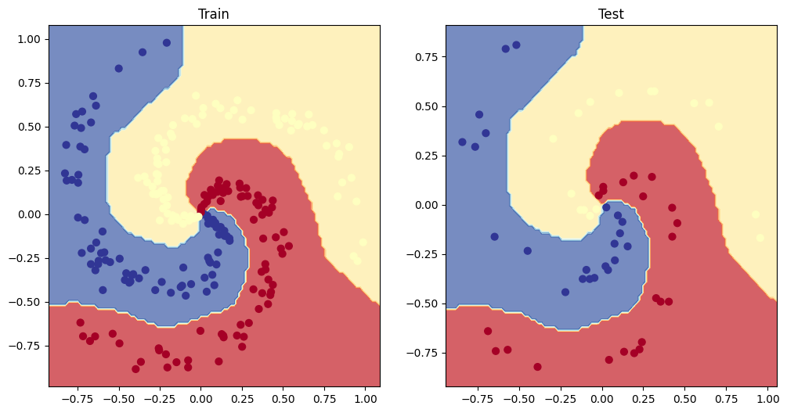

# PyTorch Neural Network Classification


##  About the Project
This repository documents my progression into **classification problems** using PyTorch. While regression predicts a continuous number, classification involves predicting whether an observation belongs to one class or another. 


In this project, I built neural networks from scratch to tackle two primary types of classification:
1. **Binary Classification:** Predicting between two options (e.g., 0 or 1).
2. **Multi-Class Classification:** Predicting among three or more options.

The core focus of this repository is understanding how to process raw model outputs (logits), choose the correct loss functions based on the problem type, and overcome underfitting by introducing non-linear activation functions.

##  Key Concepts & Workflow

### 1. The Underfitting Problem & Non-Linearity
I began by generating a dataset of two concentric circles. Initially, a purely linear model failed miserably at classifying the dots, achieving only 50% accuracy (equivalent to random guessing). Visualizing the decision boundary revealed the issue: the model was trying to draw a straight line through circular data.


*Visualizing how a purely linear model fails to separate non-linear data.*

To solve this, I introduced the **ReLU (Rectified Linear Unit)** activation function between the hidden layers. By combining linear operations with non-linear activation functions, the neural network gained the capacity to draw complex, curved decision boundaries, drastically improving accuracy.


### 2. Demystifying Model Outputs (Logits to Labels)
A major learning milestone in this project was understanding the data pipeline of a classification model's output:
* **Logits:** The raw, unnormalized output of the model's linear equations. 
* **Prediction Probabilities:** Converting logits into a format we can understand.
  * For *binary* classification, I used the **Sigmoid** activation function:
    $$S(x) = \frac{1}{1+e^{-x}}$$
  * For *multi-class* classification, I used the **Softmax** activation function, which normalizes the outputs so they sum to 1, representing the probability distribution across all classes.
* **Prediction Labels:** Using `torch.round()` (for binary) or `torch.argmax()` (for multi-class) to convert probabilities into the final discrete class predictions.

### 3. Multi-Class Classification Architecture
After mastering binary classification, I scaled the architecture to handle multi-class data (4 distinct clusters/blobs). 


*Visualizing the generated multi-class blob dataset.*

This required architectural shifts:
* **Loss Function:** Switching from `BCEWithLogitsLoss` (Binary Cross Entropy) to `CrossEntropyLoss`.
* **Output Layer:** Adjusting the final linear layer's `out_features` to match the number of target classes.


*The trained model successfully mapping complex decision boundaries across four classes.*

### 4. Advanced Evaluation Metrics
Beyond standard loss and accuracy, I explored industry-standard evaluation metrics using `TorchMetrics` and `Scikit-Learn`:
* **Precision:** Minimizing false positives.
* **Recall:** Minimizing false negatives.
* **F1-Score:** The harmonic mean of precision and recall.
* **Confusion Matrix:** A tabular visualization of true vs. predicted values.

##  Tech Stack
* **Language:** Python
* **Deep Learning Framework:** PyTorch (`torch`, `torch.nn`, `torch.optim`)
* **Machine Learning Utilities:** Scikit-Learn (Dataset generation, data splitting)
* **Metrics:** TorchMetrics
* **Data Visualization:** Matplotlib

##  Getting Started (Installation)

To clone and run this project locally:

1. **Clone the repository:**
   ```bash
   git clone [https://github.com/YOUR_USERNAME/YOUR_REPO_NAME.git](https://github.com/AbdiR0099/pytorch_neural_network_classification.git)
   cd pytorch_neural_network_classification
